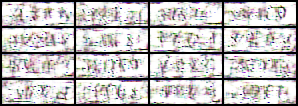
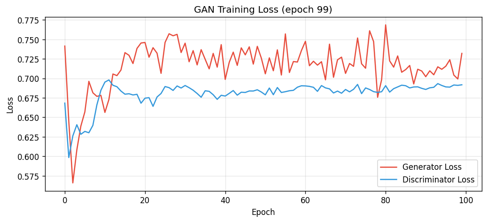
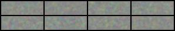
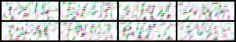
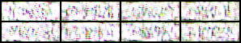
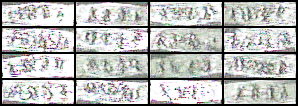
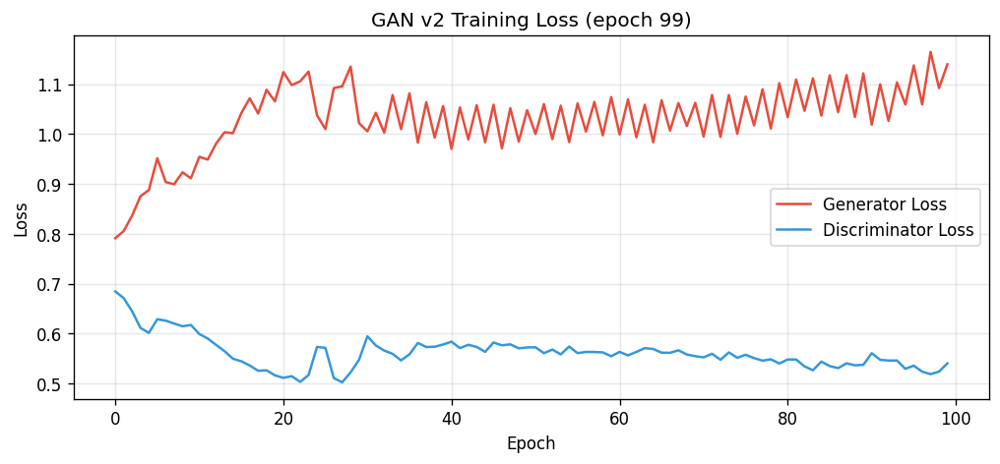
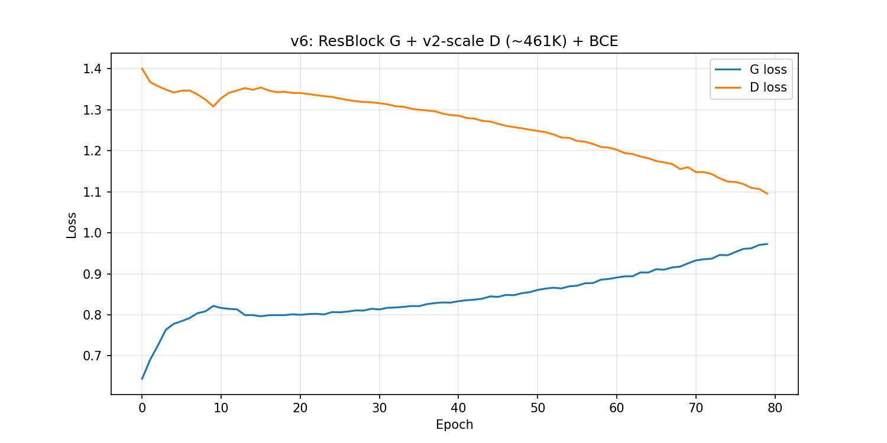

# GAN CAPTCHA 生成器

基于生成对抗网络（GAN），从随机噪声合成逼真 CAPTCHA 图像。提供两个版本：纯 PyTorch 实现和 PyTorch Lightning 实现。

## 快速开始

```bash
pip install torch torchvision pillow matplotlib
python run_gan.py
```

生成的样本和损失曲线保存在 `generated_samples/` 目录下。

## 项目结构

```
GAN-network/
├── generative_adversarial_networks.py      # PyTorch 实现（100 epochs）
├── captcha-getmean_std_labels/             # 1,136 张带标注的 CAPTCHA 图像（24×72 RGB）
└── generated_samples/                      # 输出：检查点、损失曲线、最终样本网格
```

## 数据集

1,136 张带标注的 CAPTCHA 图像，每张为 4 位字母数字代码（如 `2A2X`、`K5MR`），带有真实 CAPTCHA 系统典型的扭曲、噪声和多字体风格。

| 属性 | 值 |
|---|---|
| 样本总数 | 1,136 |
| 图像尺寸 | 24 × 72 像素 |
| 颜色通道 | RGB |
| 训练 / 验证 / 测试 | 795 / 227 / 114（70% / 20% / 10%） |

- **训练集**：训练时discriminator取一批real图和generator生成的fake图，两者一起算discrimination loss, 反向传播。
- **验证集**：不参与梯度计算，每个epoch末进行一次前向传播做过拟合监控。
- **测试集**：训练结束后测试输出。

数据预先处理：
1. 将图像从numpy.ndarry(0-255像素) -> 缩放到Pytorch Tensor张量(0-1的浮点数)
2. 防止输入值过大使部分神经元饱和从而导致浅层梯度消失

数据增强：`RandomHorizontalFlip`（随机水平翻转）、`RandomRotation(±10°)`（随机旋转）、`ColorJitter`（颜色抖动，亮度/对比度/饱和度各 0.3）。
1. 模型学习图片转换后的适应度
2. 扩充数据集，防止过拟合

## 模型架构

### 生成器

```
z ∈ R^100
  → Linear(100 → 128×6×18) → 重塑
  → BatchNorm2d → Upsample(2×)
  → Conv2d(128→128, 3×3) → BatchNorm → LeakyReLU(0.2)
  → Upsample(2×)
  → Conv2d(128→64, 3×3) → BatchNorm → LeakyReLU(0.2)
  → Conv2d(64→3, 3×3) → Tanh
  → 输出: 3×24×72 RGB
```

初始全连接层将 100 维隐向量映射为 6×18 的空间表示，经两次上采样逐步放大到 24×72。末端 Tanh 将输出约束在 [-1, 1]。

### 判别器

```
输入 3×24×72
  → Conv2d(3→10, 5×5) → MaxPool(2×2) → ReLU
  → Conv2d(10→20, 5×5) → Dropout2d → MaxPool(2×2) → ReLU
  → Flatten → Linear(900→50) → ReLU → Dropout
  → Linear(50→1) → Sigmoid
```

仅两层卷积的刻意简化结构使判别器弱于常规分类器，以维持 GAN 训练的平衡。

| 组件 | 参数量 |
|---|---|
| 生成器 | ~1.2M |
| 判别器 | ~50K |
| **总计** | **~1.25M** |

## 训练配置

| 超参数 | 值 |
|---|---|
| 优化器 | Adam |
| 学习率 | 0.0002 |
| β₁ / β₂ | 0.25 / 0.999 |
| 批大小 | 128 |
| 隐变量维度 | 100 |
| 训练轮数 | 100（纯 PyTorch）/ 200（Lightning） |
| 损失函数 | 非饱和二元交叉熵（BCE） |

较低的 β₁（0.25，而 Adam 默认值为 0.9）抑制动量以防止判别器过早压制生成器，从而稳定对抗博弈。

每个 batch 的训练步骤：

1. **生成器更新**：采样噪声 z ~ N(0, I)，生成假图像 G(z)，计算 BCE(D(G(z)), 1)，仅通过生成器反向传播。
2. **判别器更新**：计算真实损失 BCE(D(x_real), 1)，分离 G(z) 后计算假损失 BCE(D(G(z)), 0)，总损失取两者均值，仅通过判别器反向传播。

## 实验结果
1. ***初始配置***
在 CPU 上训练 50 个 epoch 约需 10 分钟（参数总量约 1.25M）。

**生成样本：**


**损失曲线：**


生成器损失从约 1.5 下降至约 0.6，判别器损失稳定在 0.8–1.0 之间，振荡模式为健康 GAN 训练的典型特征。

**样本演进：**

| Epoch 0 | Epoch 25 | Epoch 49 |
|---|---|---|
|  |  |  |

生成器从无结构随机噪声逐步学习到可辨识的 CAPTCHA 类图案，最终输出展现出扭曲、噪声和多字体风格等真实 CAPTCHA 的核心视觉特征。不同噪声输入产生明显不同的输出，未出现模式坍塌。

2. ***增强Discriminator-初始配置10个Epoch后损失基本无变化***

Discriminator结构修改：
input ∈ R^(3×24×72)
  │
  ├─ Conv2d(3→32,  k=4, stride=2, pad=1) → LeakyReLU(0.2)    → (32,  12, 36)
  ├─ Conv2d(32→64,  k=4, stride=2, pad=1) → BatchNorm → LReLU → (64,   6, 18)
  ├─ Conv2d(64→128, k=4, stride=2, pad=1) → BatchNorm → LReLU → (128,  3,  9)
  ├─ Conv2d(128→256, k=3, stride=1, pad=1) → BatchNorm → LReLU → (256,  3,  9)
  ├─ AdaptiveAvgPool2d(1)                                      → (256,  1,  1)
  ├─ Flatten → Linear(256→1)
  └─ raw logit (no sigmoid)

**生成样本：**


**损失曲线：**


**损失曲线对比**
|  | v1 (D ≈ 45K) | v2 (D ≈ 461K) |
|---|---|---|
| Epoch 0 | G=0.74 / D=0.67 | G=0.79 / D=0.68 |
| Epoch 99 | G=0.73 / D=0.69 | G=1.14 / D=0.54 |
| 趋势 | 完全平坦，10 epoch 后停滞 | 持续变化，有对抗博弈 |
问题：discriminator偏强，generator loss整体上升。

3. ***增强Generator-发现性能瓶颈，损失在上升***
引入resBlock残差结构加参数扩张

**逐项差异汇总**

| 维度 | V1 | V6 | 变化 |
|------|:--:|:--:|------|
| 参数量 | ~1.62M | 4.53M | **+180%** |
| 初始通道数 | 128 | 256 | 翻倍 |
| 残差连接 | 无 | 2 个 ResBlock | 新增 |
| 卷积层数 | 3 | 6 | 翻倍 |
| 1×1 投影 | 无 | up2 有 | 新增 |
| 输出尺寸 | 3×24×72 | 3×24×72 | 相同 |

**关键变化说明**

1. **残差连接**：V6 在每次上采样后引入 ResBlock，使梯度能绕过卷积层直接回传，缓解深层生成器的训练困难。

2. **通道翻倍**：初始通道从 128 提升至 256，更大的特征容量为更丰富的纹理和笔画细节提供了表达空间。

3. **1×1 投影**：当残差块改变通道维度时（256→128），通过 1×1 卷积对齐跳跃连接的维度，确保加法操作可行。

4. **总参数增长**：从 1.62M 到 4.53M，增长约 180%，主要来自残差块中额外的卷积层和翻倍的通道数。


**生成样本：**


**损失曲线：**



## 两个实现版本

### `run_gan.py` — 纯 PyTorch

仅依赖 `torch` 和 `torchvision`，无需额外框架。自包含训练循环，手动交替优化。每 5 个 epoch 保存一次检查点，训练结束后输出 16 格最终样本图和损失曲线。

```bash
python run_gan.py
```

### `generative_adversarial_networks.py` — PyTorch Lightning

基于 `pytorch_lightning` 的结构化训练，支持 TensorBoard 日志记录和 200 epoch 训练。

```bash
pip install pytorch-lightning tensorboard
python generative_adversarial_networks.py
tensorboard --logdir tb_logs
```

## 改进方向

- **WGAN-GP**：用 Wasserstein 距离加梯度惩罚替代 BCE 损失，获得更稳定的训练和更高质量的样本。
- **条件 GAN**：以 CAPTCHA 标签为条件，实现定向生成特定代码。
- **谱归一化**：在判别器卷积层添加谱归一化，强制 Lipschitz 连续性以稳定训练。
- **感知损失**：用特征匹配或感知损失补充对抗损失，提升视觉保真度。
- **数据集扩展**：当前仅 795 个训练样本，更多数据或更激进的数据增强可提升多样性。

## 参考文献

- Goodfellow et al. (2014). "Generative Adversarial Networks." *NeurIPS*.
- Radford et al. (2016). "Unsupervised Representation Learning with DCGANs." *ICLR*.
- Arjovsky et al. (2017). "Wasserstein GAN." *ICML*.
- Gulrajani et al. (2017). "Improved Training of Wasserstein GANs." *NeurIPS*.
